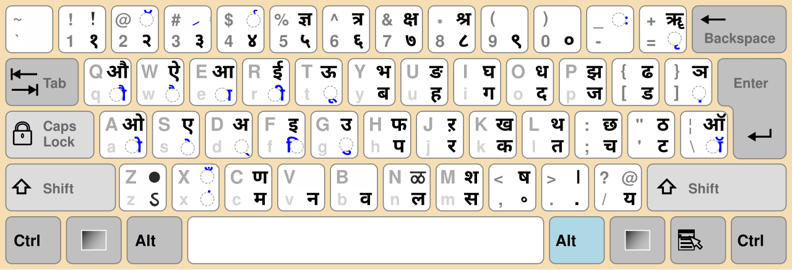
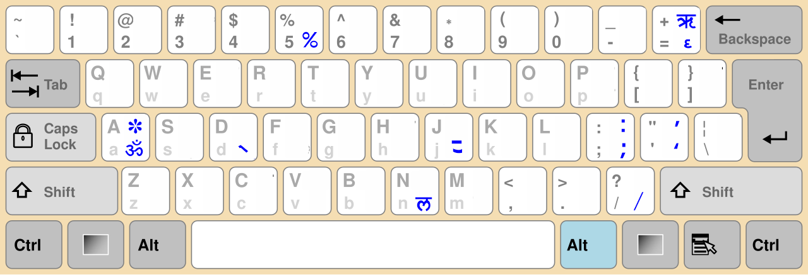

# SHREE OM (UB) INSCRIPT Keyboard

**SHREE OM (UB) INSCRIPT** is a free and open-source **InScript-style Hindi keyboard** designed for use with the **ShreeLipi (legacy) font**, built using **Keyman Developer**.

This keyboard is intended for users who still work with legacy ShreeLipi documents and prefer the standard **InScript layout** across **Windows, macOS, and Linux**.

---

## ✨ Features

* InScript-style Hindi keyboard layout
* Compatible with **ShreeLipi (legacy) font**
* Supports common conjuncts and matras, including:

  * क्र, त्र, ज्ञ, क्ष, श्र (as implemented)
* Built using **Keyman**
* Works on **Windows, macOS, and Linux**
* Free and open-source (**GPL-3.0**)

---

## 🖥 Supported Platforms & Requirements

### ✅ Supported Operating Systems

* **Windows 10 / Windows 11**
* **macOS**
* **Linux (Ubuntu and other supported distributions)**

### 📌 Requirements (All Platforms)

* **Keyman Desktop** installed
* **ShreeLipi font** installed on the system

> ⚠️ This project does **not** distribute the ShreeLipi font.

---

## 📥 Step 1: Download & Install Keyman

### 🔹 Windows / macOS / Linux

1. Visit:
   👉 [https://keyman.com/desktop](https://keyman.com/desktop)
2. Download **Keyman Desktop** for your operating system
3. Install Keyman using the standard installer for your OS
4. After installation:

   * Windows: Keyman icon appears in the system tray
   * macOS: Keyman appears in the menu bar
   * Linux: Keyman runs as a background service

> Keyman Desktop is required to run `.kmp` keyboard files on all platforms.

---

## ⌨️ Step 2: Download & Install the Keyboard (.kmp)

### 🔹 Download the Keyboard

1. Go to the repository **Releases** page:
   👉 [https://github.com/umeshbedi/shree-om-ub-inscript/releases](https://github.com/umeshbedi/shree-om-ub-inscript/releases)
2. Download the latest keyboard file:

   ```
   shree_om_ub_inscript.kmp
   ```

---

### 🔹 Install the Keyboard

#### Windows

* Double-click the `.kmp` file
  **OR**
* Right-click → **Install with Keyman**

#### macOS

* Double-click the `.kmp` file
* Keyman will prompt to install the keyboard

#### Linux

* Double-click the `.kmp` file
  **OR**
* Install via Keyman Configuration

Keyman will automatically install and activate the keyboard.

---

## 📝 Step 3: Using the Keyboard

1. Open any text editor (Notepad, TextEdit, LibreOffice, etc.)
2. Set the font to **ShreeLipi**
3. Select the keyboard from Keyman:

   ```
   SHREE OM (UB) INSCRIPT
   ```
4. Start typing using the **InScript layout**

> ℹ️ Hindi–English switching is handled by the OS or Keyman keyboard selection.

---

## 🗺 Keyboard Layout

Below are the keyboard layouts used by this keyboard (standard InScript):

### Normal & Shift Layer



### Right Alt (AltGr) & Right Alt + Shift Layer



---

## ⚖️ License

This project is licensed under the **GNU General Public License v3.0 (GPL-3.0)**.

* You are free to use, modify, and redistribute this keyboard
* Any redistributed or modified version **must remain open-source**
* Source files must be provided when redistributing

See `LICENSE.md` for the full license text.

---

## ⚠️ Important Legal Notice (ShreeLipi Disclaimer)

* **ShreeLipi font and encoding are proprietary** and owned by their respective rights holders
* This project **does NOT distribute ShreeLipi fonts**
* This keyboard only provides **key mappings** compatible with ShreeLipi encoding
* Users must obtain and use ShreeLipi fonts **legally**

### If the ShreeLipi Organization Raises Any Concern

* This project does **not** claim ownership of ShreeLipi
* The keyboard can be:

  * Modified
  * Renamed
  * Or removed upon valid request

Please open a **GitHub Issue** for discussion.

---

## 👤 Author

**Umesh Kumar Bedi**
MCA (AI & Data Science)
Open-source contributor

---

## 🤝 Contributions

Contributions, bug reports, and improvements are welcome.

* Fork the repository
* Create a feature branch
* Submit a pull request

---

## 🏁 Final Notes

This keyboard is intended for:

* Legacy document editing
* Printing workflows
* Educational and archival use

For modern workflows, **Unicode Hindi fonts and standard InScript keyboards** are recommended.

